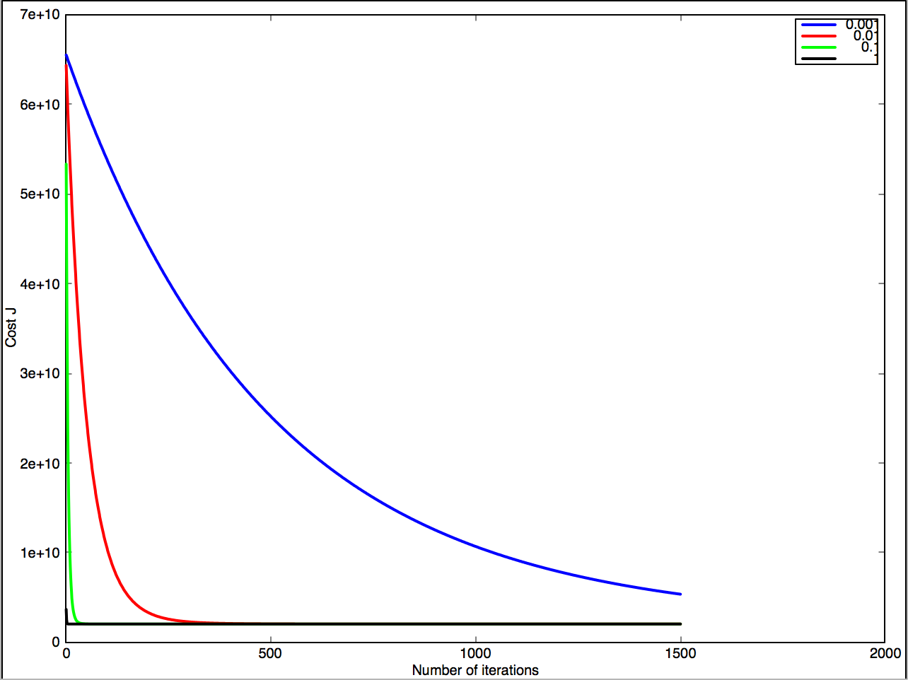

# Output for Linear Regression with Multiple Variables/Features

Loading data ...
First 10 examples from the dataset: 
 x = [2104.0000 3.0000], y = 399900 
 x = [1600.0000 3.0000], y = 329900 
 x = [2400.0000 3.0000], y = 369000 
 x = [1416.0000 2.0000], y = 232000 
 x = [3000.0000 4.0000], y = 539900 
 x = [1985.0000 4.0000], y = 299900 
 x = [1534.0000 3.0000], y = 314900 
 x = [1427.0000 3.0000], y = 198999 
 x = [1380.0000 3.0000], y = 212000 
 x = [1494.0000 3.0000], y = 242500 
Normalizing Features ...
First 10 examples from the dataset after normalization: 
 x = [1 0.1300 -0.2237], y = 399900 
 x = [1 -0.5042 -0.2237], y = 329900 
 x = [1 0.5025 -0.2237], y = 369000 
 x = [1 -0.7357 -1.5378], y = 232000 
 x = [1 1.2575 1.0904], y = 539900 
 x = [1 -0.0197 1.0904], y = 299900 
 x = [1 -0.5872 -0.2237], y = 314900 
 x = [1 -0.7219 -0.2237], y = 198999 
 x = [1 -0.7810 -0.2237], y = 212000 
 x = [1 -0.6376 -0.2237], y = 242500 
Running gradient descent ...

Theta computed from gradient descent: 
 340412.563014 
 110540.566546 
 -6558.990548 

Predicted price of a 1650 sq-ft, 3 br house (using gradient descent):
 $294528.300918
Solving with normal equations...
Theta computed from the normal equations: 
 89597.909542 
 139.210674 
 -8738.019112 

Predicted price of a 1650 sq-ft, 3 br house (using normal equations):
 $293081.464335
