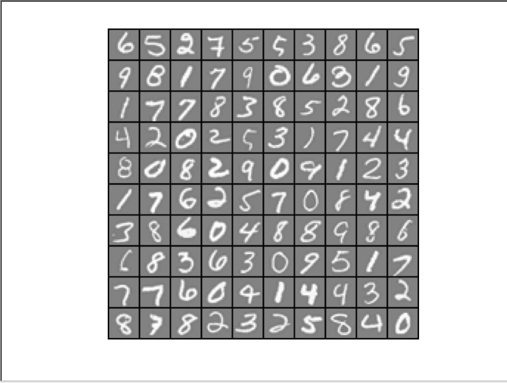

# Output for Multi-class Logistic Regression Classifier

Loading and Visualizing Data ...

Testing lrCostFunction() with regularization

Cost: 2.534819

Expected cost: 2.534819

Gradients:

 0.146561 

 -0.548558 

 0.724722 

 1.398003 

Expected gradients:

 0.146561

 -0.548558

 0.724722

 1.398003

Training One-vs-All Logistic Regression...

Iteration    50 | Cost: 1.386891e-02

Iteration    50 | Cost: 5.725252e-02

Iteration    50 | Cost: 6.307036e-02

Iteration    50 | Cost: 3.556440e-02

Iteration    50 | Cost: 6.183781e-02

Iteration    50 | Cost: 2.163288e-02

Iteration    50 | Cost: 3.604681e-02

Iteration    50 | Cost: 8.588253e-02

Iteration    50 | Cost: 7.976315e-02

Iteration    50 | Cost: 9.989660e-03

Training Set Accuracy: 94.940000
