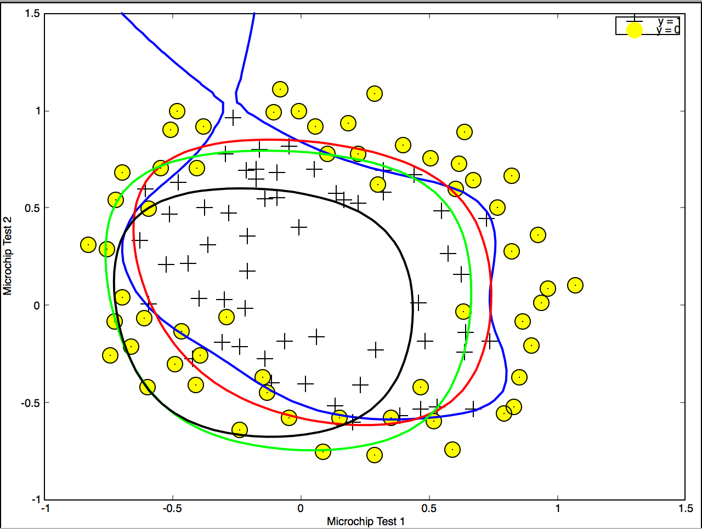
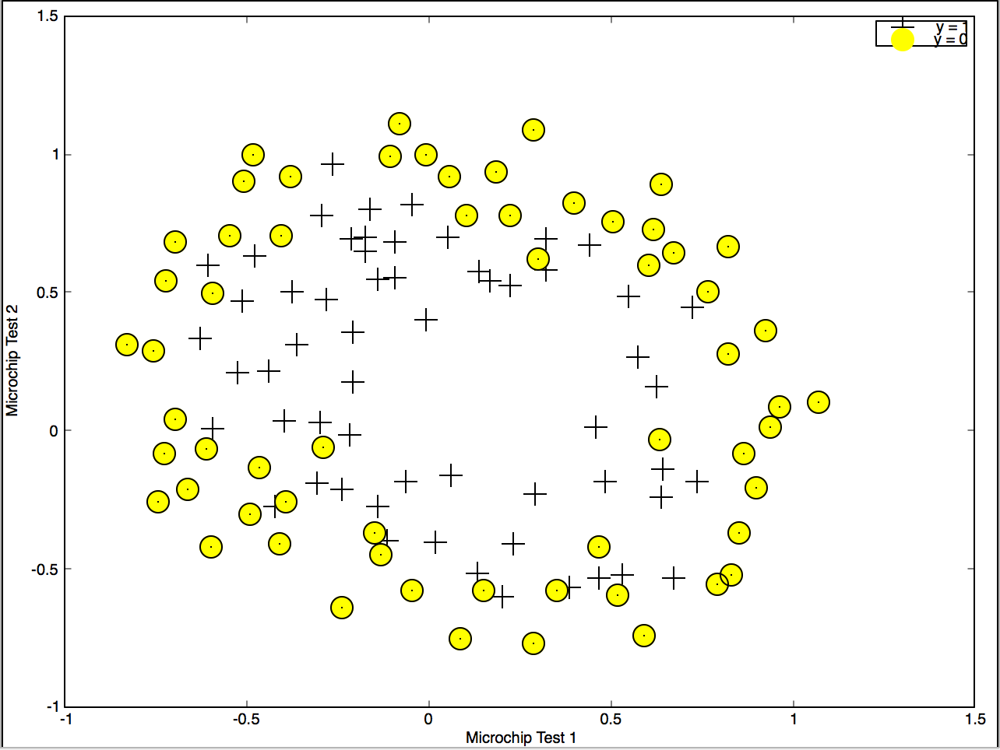

# Output for Regularized Logistic Regression with Order-6 Feature Mapping

Cost at initial theta (zeros): 0.693147

Expected cost (approx): 0.693

Gradient at initial theta (zeros) - first five values only:

 0.008475 

 0.018788 

 0.000078 

 0.050345 

 0.011501 

Expected gradients (approx) - first five values only:

 0.0085

 0.0188

 0.0001

 0.0503

 0.0115

Cost at test theta (with lambda = 10): 3.164509

Expected cost (approx): 3.16

Gradient at test theta - first five values only:

 0.346045 

 0.161352 

 0.194796 

 0.226863 

 0.092186 

Expected gradients (approx) - first five values only:

 0.3460

 0.1614

 0.1948

 0.2269

 0.0922

Comparing results with different values of lambda...

Train Accuracy: 61.016949

Expected accuracy (with lambda = 1): 83.1 (approx)

